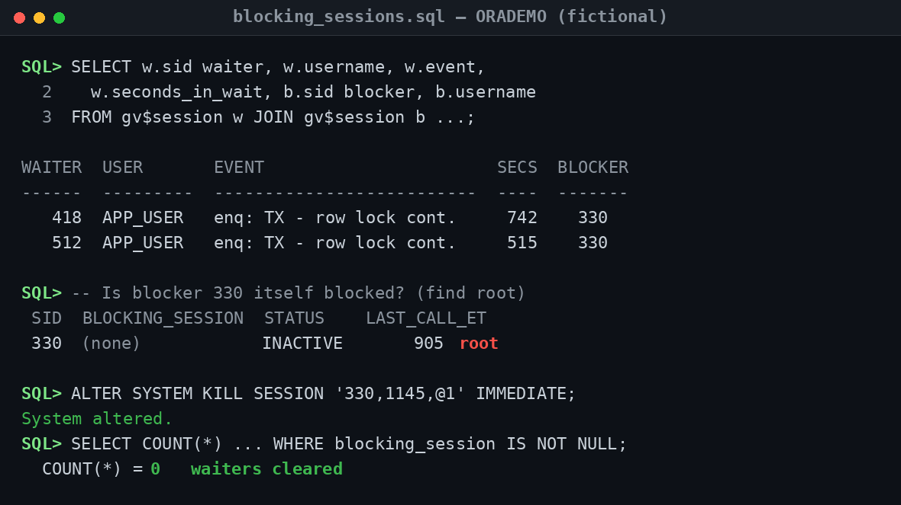
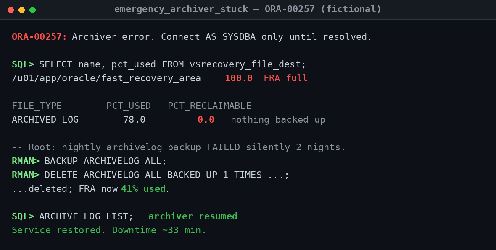
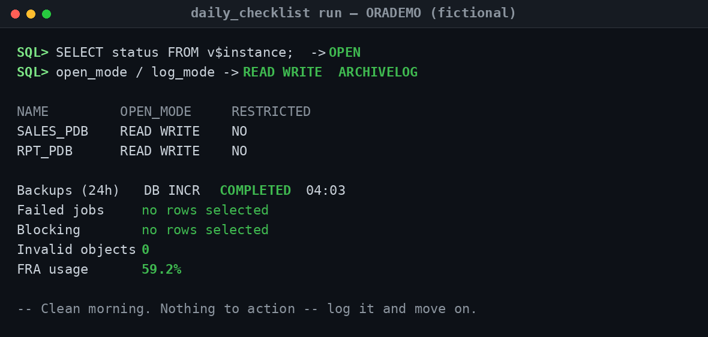
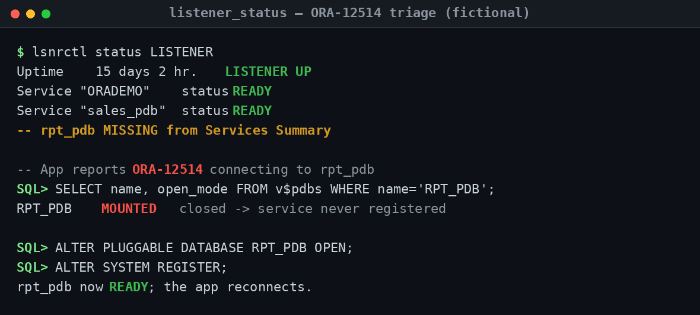
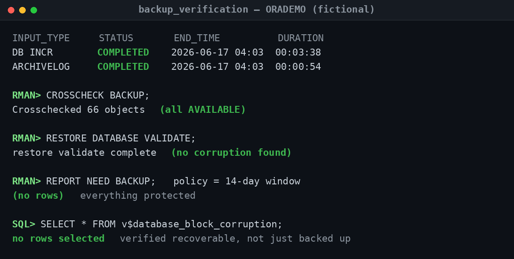

## Operational Screenshots (Proof of Work)

Runbooks describe what *should* happen. This section shows the work actually being done — real terminal sessions from a sanitized demo database (`ORADEMO`), walking from symptom to diagnosis to verified fix. Every value is fictional; there are no real hostnames, SIDs, schemas, or company data. The point isn't the commands — it's the **judgment**: how an experienced operator reads the output, finds the root cause rather than the symptom, and confirms service is genuinely restored before calling it done.

---

### 1 · Clearing a blocking-session chain ("the app is hung")

**Problem demonstrated.** The classic "the application froze" page. Two `APP_USER` sessions have been stuck for 12+ minutes on `enq: TX - row lock contention`, both pointing at the same blocker (session 330).

**What an experienced DBA concludes.** The instinct of a junior DBA is to kill the two sessions that are *complaining*. The senior move is the second query: confirm whether the blocker is itself blocked. Here 330 is `INACTIVE` with a 905-second `LAST_CALL_ET` — a batch job that errored mid-transaction and is now sitting on a row lock with no commit. That makes 330 the **root blocker**, and the two waiters are victims. Kill 330 (with the batch owner's sign-off) and the waiters clear instantly — which they do (`COUNT(*) = 0`).

**Troubleshooting takeaway.** Always walk the chain to the *root* blocker before killing anything; the loudest session is rarely the cause. And clearing the lock is only half the fix — the real follow-up is the batch job's commit/error handling so the same orphaned transaction can't recur.

---

### 2 · Recovering an archiver-stuck outage (ORA-00257)

**Problem demonstrated.** A production-down incident: new connections are failing with `ORA-00257` ("Archiver error"). The database has stopped accepting work because it can't archive its redo logs.

**What an experienced DBA concludes.** The Fast Recovery Area is 100% full and `0.0%` is reclaimable — which is the real story. The space didn't just fill; *nothing was reclaimable* because the nightly archive-log backup had been failing silently for two nights, so no logs had been backed up and released. The fix is deliberately **not** deleting archive logs at the OS level (that would silently destroy recoverability). It's backing them up with RMAN first, then deleting the backed-up copies — FRA drops to 41%, the archiver resumes, and connections succeed. Total downtime ~33 minutes.

**Troubleshooting takeaway.** `ORA-00257` is a space symptom of a backup problem. Reclaim space *through* RMAN, never around it. The lasting fix lives in monitoring: alert on backup-job failures **and** on FRA percent-used, so the next one is caught as a warning at 80%, not an outage at 100%.

---

### 3 · A clean daily health pass (disciplined operations)

**Problem demonstrated.** Not an incident — the *absence* of one. This is the start-of-day pass that prevents the other screenshots from ever happening.

**What an experienced DBA concludes.** Everything that matters is green in one glance: instance `OPEN` and in `ARCHIVELOG`, both application PDBs `READ WRITE`, last night's incremental `COMPLETED`, no failed jobs, no blocking, zero invalid objects, FRA at a comfortable 59%. There is nothing to action — and that is the point. The value of running the same pass every morning is that a *bad* line (a `FAILED` backup, a blocking chain, FRA at 95%) jumps out immediately against the baseline.

**Troubleshooting takeaway.** Consistency is the cheapest reliability tool you have. A two-minute daily checklist turns most 2am incidents into routine daytime maintenance, because the early warning was visible days before the failure.

---

### 4 · Listener triage done right (ORA-12514)

**Problem demonstrated.** Users can't connect to one service (`rpt_pdb`) with `ORA-12514` ("service not known"), while everything else works. The tempting wrong conclusion is "the listener is broken."

**What an experienced DBA concludes.** The listener is fine — 15 days uptime, other services `READY`. The tell is that `rpt_pdb` is **missing** from the Services Summary, and the reason is one query away: the PDB is `MOUNTED`, not `OPEN`, so its service never registered. Open the PDB, force registration, and the service comes back `READY`. The listener was never the problem; the closed PDB was.

**Troubleshooting takeaway.** `ORA-12514` is a *registration* problem, not a listener-down problem. Triage in order: confirm the listener is up, then confirm the database/PDB is open and the service is `READY`. Most "connection" incidents are resolved at the database layer, not the listener.

---

### 5 · Proving backups are recoverable, not just present

**Problem demonstrated.** The question that ends careers when answered wrong: *"If we lost this database right now, could we get it back?"* A "backup succeeded" email does not answer it.

**What an experienced DBA concludes.** This is verification, not hope. Both backups `COMPLETED`; `CROSSCHECK` confirms all 66 pieces are physically `AVAILABLE`; `RESTORE DATABASE VALIDATE` proves the backups are actually usable with no corruption; `REPORT NEED BACKUP` returns no rows, so everything is protected inside the 14-day recovery window; and `v$database_block_corruption` is empty. That chain is the difference between *"we take backups"* and *"we have proven we can recover."*

**Troubleshooting takeaway.** A backup you have never restored is a theory, not a backup. Validate routinely — crosscheck, `RESTORE ... VALIDATE`, and a periodic real restore to a scratch host — so recoverability is a measured fact, not an assumption you discover is false during an outage.

---

> **All screenshots are fully sanitized and fictional.** Database/container names (`ORADEMO`, `SALES_PDB`, `RPT_PDB`), users, paths, and values are illustrative demo data created for this portfolio — no production, employer, or confidential information is shown. Each capture mirrors the annotated text in [`sample_outputs/`](sample_outputs/), where every example ends with a **"Read:"** note explaining the diagnosis and action.
